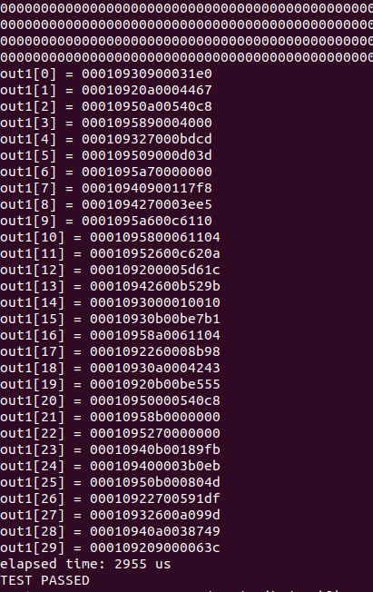
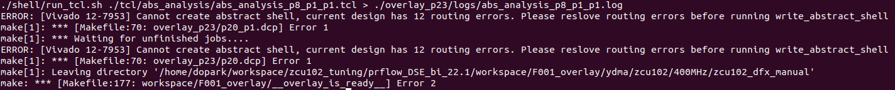
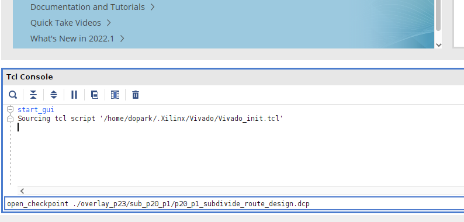

# REFINE: Runtime Execution Feedback for INcremental Evolution on FPGA Designs

The starting code is forked from [this repo](https://github.com/icgrp/prflow_nested_dfx)
[[PARK/FPT2022](https://ic.ese.upenn.edu/abstracts/nested_dfx_fpt2022.html)].


## Setup
The framework is developed with Ubuntu 20.04 with kernel 5.4.0, Vitis 2022.1 
and Xilinx ZCU102 evaluation board.

#### Vitis
If you install Vitis on **/tools/Xilinx**, you should set **Xilinx_dir** 
in [./common/configure/configure.xml](./common/configure/configure.xml) as below.
```xml
  <spec name = "Xilinx_dir"         value = "/tools/Xilinx/Vitis/2022.1/settings64.sh" />
```

#### Common image
The ZYNQMP common image file can be downloaded from the [Vitis Embedded Platforms](https://www.xilinx.com/support/download/index.html/content/xilinx/en/downloadNav/embedded-platforms/2022-1.html)
page.
Locate the image to the directory of your choice(e.g. /opt/platforms/), and adjust the configuration in 
[./common/configure/zcu102/configure.xml](./common/configure/zcu102/configure.xml) as below.
```xml
  <spec name = "sdk_dir"             value = "/opt/platforms/xilinx-zynqmp-common-v2022.1/environment-setup-cortexa72-cortexa53-xilinx-linux" />
```

#### ZCU102 Base DFX platform
You can create ZCU102 Base DFX paltform from 
[Vitis Embedded Platform Source repo(2022.1 branch)](https://github.com/Xilinx/Vitis_Embedded_Platform_Source/tree/2022.1).
We slightly modified the floorplanning of ZCU102 Base DFX platform
to reserve more area for the dynamic region.
This can be done by replacing 
[this file](https://github.com/Xilinx/Vitis_Embedded_Platform_Source/blob/2022.1/Xilinx_Official_Platforms/xilinx_zcu102_base_dfx/hw/sources/constraints/static_impl_early.xdc) 
to our [modified xdc file](./common/etc/static_impl_early_22_1.xdc).
You can follow the instructions to generate the ZCU102 DFX platform.
For instance, 
```bash
cd ./Xilinx_Official_Platforms/xilinx_zcu102_base_dfx/
make all PREBUILT_LINUX_PATH=/opt/platforms/xilinx-zynqmp-common-v2022.1/
```

Once you successfully generated ZCU102 DFX platform, locate the generated platform to the directory of your choice(e.g. /opt/platforms/),
and adjust the configurations in [./common/configure/zcu102/configure.xml](./common/configure/zcu102/configure.xml) as below.
```xml
  <spec name = "PLATFORM_REPO_PATHS" value=  "/opt/platforms/xilinx_zcu102_base_dfx_202210_1" />
  <spec name = "ROOTFS"              value = "/opt/platforms/xilinx-zynqmp-common-v2022.1" />
  <spec name = "PLATFORM"            value = "xilinx_zcu102_base_dfx_202210_1" />
```

#### ZCU102 Base platform
We use ZCU102 Base platform for the monolithic flow.
Similarly, you can generate ZCU102 platform.
```bash
cd ./Xilinx_Official_Platforms/xilinx_zcu102_base_dfx/
make all PREBUILT_LINUX_PATH=/opt/platforms/xilinx-zynqmp-common-v2022.1/
```

Once you successfully generated ZCU102 DFX platform, locate the generated platform to the directory of your choice(e.g. /opt/platforms/),
and adjust the configurations in [./common/configure/zcu102/configure.xml](./common/configure/zcu102/configure.xml) as below.
```xml
  <spec name = "BASE_PLATFORM_REPO_PATHS" value=  "/opt/platforms/xilinx_zcu102_base_202210_1" />
  <spec name = "BASE_PLATFORM"            value = "xilinx_zcu102_base_202210_1" />
```


## Pre-generated NoC overlay
If you want to generate a new overlay from scratch, please refer to [Appendix 1: Generate NoC overlay](#gen_noc_overlay).
First, in your `/<PROJECT_DIR>/`, create `/<PROJECT_DIR>/workspace` directory.
Then, you can download the pre-generated NoC overlay from [here](https://drive.google.com/drive/folders/16sRIMmyqjawautBHWOcVuaYvhOsECIMo?usp=drive_link).
You will have one .img file and .zip file. 
Extract the downloaded .zip file. You will have `F001_overlay` folder. Copy this folder under `/<PROJECT_DIR>/workspace/` so that you have `/<PROJECT_DIR>/workspace/F001_overlay`.


<a name="create_img"></a>
## Prepare the boot image and Run on the device

1. Use .img file either you downloaded or you generated to create boot image.
   In Ubuntu, run Startup Disk Creator, select .img file, select your SD card and click "Make Startup Disk".

2. Safely unplug the SD card from the workstation and slide it into the ZCU102. Power on the device.

3. You can refer to [this post](https://dj-park.github.io/posts/2022/1/scp-emb/) set up the ip addresses for the workstation and the ZCU102. Note that the initital password of the system is "root".

4. scp BOOT.BIN and .xclbin files for the NoC overlay. 10.10.7.1 is the ip address you assigned for the ZCU102.
   ```
   scp ./workspace/F001_overlay/ydma/zcu102/400MHz/zcu102_dfx_manual/overlay_p23/package/sd_card/* root@10.10.7.1:/run/media/mmcblk0p1/
   ```
   Then, reboot the ZCU102.

5. Select a benchmark in Makefile and compile. I selected "rendering" for the demonstration.
   ```
   make all -j$(nproc)
   ```
   scp the generated bitstreams and host executable to the ZCU102.
   ```
   scp -r ./workspace/F005_bits_rendering/sd_card/* root@10.10.7.1:/run/media/mmcblk0p1/
   ```

6. ssh to ZCU102, cd to /run/media/mmcblk0p1/, and run the application.
   ```
   cd /run/media/mmcblk0p1
   ./run_app.sh
   ```
   You will see a projected image of a bunny follwed by some data. These are the counter data retrieved from the hardware execution that we will use to identify the bottleneck.
   For the kernel execution time, we will use the value in `summary.csv`.
<p align="center">  </p>


Note-1: `__static_loaded__` indicates the state that the level-1 DFX region is loaded. If you reboot the ZCU102, please remove `__static_loaded__` before running `run_app.sh`. 
If you take a look at `run_app.sh`, we load the level-1 DFX region (`dynamic_region.xclbin`) only when it's not loaded yet.
If you try to load the level-1 DFX region when it's already loaded, the system gets stuck in the unknown state.
If you try load the non-level-1 DFX xclbins when `dynamic_region.xclbin` is not loaded, the system gets stuck in the unknown state.

Note-2: For the "optical flow" benchmark, you need to scp [current](./input_src/current) directory to the SD card. 
   ```
   scp -r ./input_src/current root@10.10.7.1:/run/media/mmcblk0p1/
   ```

## Pre-generated monolithic overlay
If you want to generate a new monolithic overlay from scratch, please refer to [Appendix 2: Generate monolithic overlay](#gen_mono_overlay).
Download the pre-generated monolithic overlay from [here](https://drive.google.com/drive/folders/1IuIxzzjP5i4Dvp3juGpFbzOYOMqaQ1HH?usp=drive_link).
Extract the downloaded .zip file. You will have `F007_overlay_mono` folder. Copy this folder under `/<PROJECT_DIR>/workspace/` so that you have `/<PROJECT_DIR>/workspace/F007_overlay_mono`.


## Run incremental refinement
`sample_run.sh` is an example script to run the both monolithic-only incremental refinement and NoC&rarr;monolithic incremental refinement.
Note that you need to select the appropriate application with `prj_name` variable in Makefile. It assumes that you assigned 10.10.7.1 to the ZCU102 and 10.10.7.2 to the host.
   ```
   source sample_run.sh
   ```
Make sure you adjust the project directorty and the username of your host machine.
[./common/configure/zcu102/configure.xml](./common/configure/zcu102/configure.xml).
```xml
  <spec name = "ip_zcu102"          value = "10.10.7.1" />
  <spec name = "ip_host"            value = "10.10.7.2" />
  <spec name = "project_dir"        value = "YOUR_PROJECT_DIR" />
  <spec name = "username"           value = "YOUR_USERNAME" />
```


<br />
<br />
<br />

<a name="gen_noc_overlay"></a>
## Appendix 1: Generate NoC overlay
Please take a look at [this repo](https://github.com/icgrp/prflow_nested_dfx) for the overview.

In your `/<PROJECT_DIR>/`, to generate `/<PROJECT_DIR>/workspace/F001_overlay` directory, run the command below. You can select any benchmark in Makefile.
Note that this process can take >4 hours depending on the system CPU/RAM because of the sequentialized charateristic of
Xilinx Nested DFX technology.

```
make overlay -j$(nproc)
```

You will encounter the error shown below.



We consider this as a potential bug in Vivado.
In this case, cd to `/<PROJECT_DIR>/workspace/F001_overlay/ydma/zcu102/400MHz/zcu102_dfx_manual/` and open up **Vivado GUI** with
`vivado &`. In Tcl console, manually copy and paste the contents of the scripts that encountered the errors as shown below.
**You need to run one command at a time instead of entering multiple lines of tcl commands.**

<p align="center">  </p>

With the given floorplanning(\*.xdc files), scripts that cause this error are:

- `/<PROJECT_DIR>/workspace/F001_overlay/ydma/zcu102/400MHz/zcu102_dfx_manual/tcl/nested/pr_recombine_p20.tcl`
- `/<PROJECT_DIR>/workspace/F001_overlay/ydma/zcu102/400MHz/zcu102_dfx_manual/tcl/nested/pr_recombine_p20_p1.tcl`

Once you manually generate `p20.dcp` and `p20_p1.dcp`, 
in `/<PROJECT_DIR>/workspace/F001_overlay/ydma/zcu102/400MHz/zcu102_dfx_manual/`,
do 
```
make all -j8
```
to run the rest of the Makefile. Note that the number 8 is an arbitrary value so that the script doesn't overutilize the system memory.
Once the Makefile finishes, 
in the same directory, run the rest of the commands in
`/<PROJECT_DIR>/workspace/F001_overlay/run.sh` that were supposed to run.
For instance, copy/paste the lines below in the terminal.
```
./shell/run_xclbin.sh
cp -r ../package ./overlay_p23/
cp ./overlay_p23/*.xclbin ./overlay_p23/package/sd_card
cd overlay_p23
cp ../util_scripts/get_blocked_resources_abs_shell.py .
cp ../util_scripts/parse_ovly_util.py .
cp ../util_scripts/blocked_analysis.py .
python get_blocked_resources_abs_shell.py
python parse_ovly_util.py
python blocked_analysis.py
```

This conclues overlay generation and creates `/<PROJECT_DIR>/workspace/F001_overlay/` directory.
Use `/<PROJECT_DIR>/workspace/F001_overlay/ydma/zcu102/400MHz/zcu102_dfx_manual/overlay_p23/package/sd_card.img`
to generate the boot image.

<a name="gen_mono_overlay"></a>
## Appendix 2: Generate monolithic overlay
The command below will generate `/<PROJECT_DIR>/workspace/F007_overlay_mono/` directory. You can select any benchmark in Makefile.
This process will take less than an hour.
```
make overlay_mono -j$(nproc)
```

## Appendix 3: CNN benchmarks
Please refer to https://github.com/dj-park/finn_v22.1 repo to get the FINN framework used in the experiments.
We modified the source codes a little so that FINN generates HLS source codes and then stops.
You first need to git clone this modified FINN framework to your local.
Then, you need to adjust variables like `PRJ_DIR`,`FINN_HOST_BUILD_DIR`, `FINN_V22_DIR`, etc in 
[./input_src/finn_cnn1/build_dataflow.sh](./input_src/finn_cnn1/build_dataflow.sh).


<a name="known_issues"></a>
## Appendix 4: Known issues

#### Digit Recognition place_design error
If we run the incremental refinement for Digit Recognition with the defined design space, 
one of the parallel Vivado run will fail when `PAR_FACTOR` is about 60~100.
When it fails, if we exit the current incremental script and then re-run the compilation for the exact same configuration,
all the operators will be successfully compiled.
We haven't figured out the cause of the bug.

#### Implementation directives
You can change the directives for place_design and route_design by modifying
[./common/configure/zcu102/configure.xml](./common/configure/zcu102/configure.xml) file.
```xml
  <spec name = "place_design_NoC_directive"       value = "EarlyBlockPlacement" />
  <spec name = "place_design_mono_directive"      value = "EarlyBlockPlacement" />
  <spec name = "route_design_NoC_directive"       value = "Explore" />
  <spec name = "route_design_mono_directive"      value = "Explore" />
```
We have seen that 
1) sometimes the final design point of the NoC flow doesn't meet the timing in the monolithic flow OR
2) sometimes NoC flow fails earlier than the monolithic-only flow OR
3) sometime monolithic-only flow fails earlier than the NoC flow.

In experiments, we use the diretives above for all benchmarks except for CNN-1.
For CNN-1, `ExtraTimingOpt` is used for both `place_design_NoC_directive` and `place_design_mono_directive`.
We will explore these directives in the future work.

